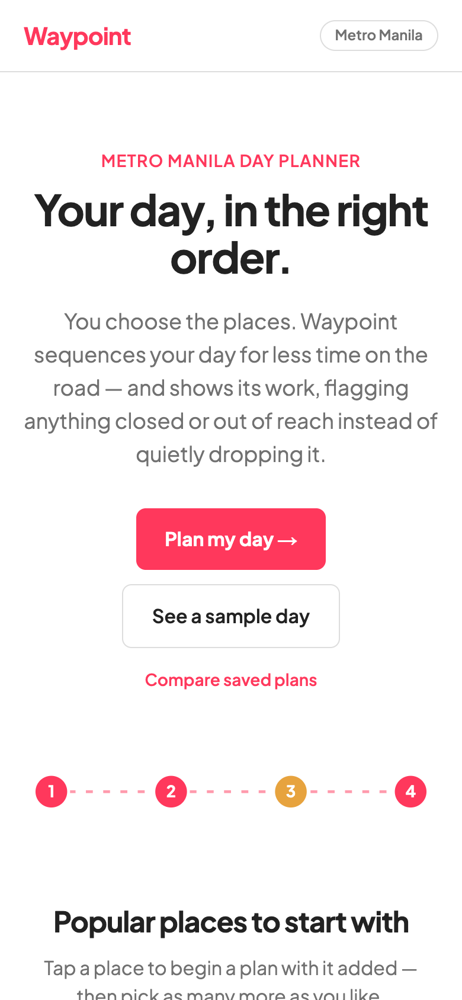
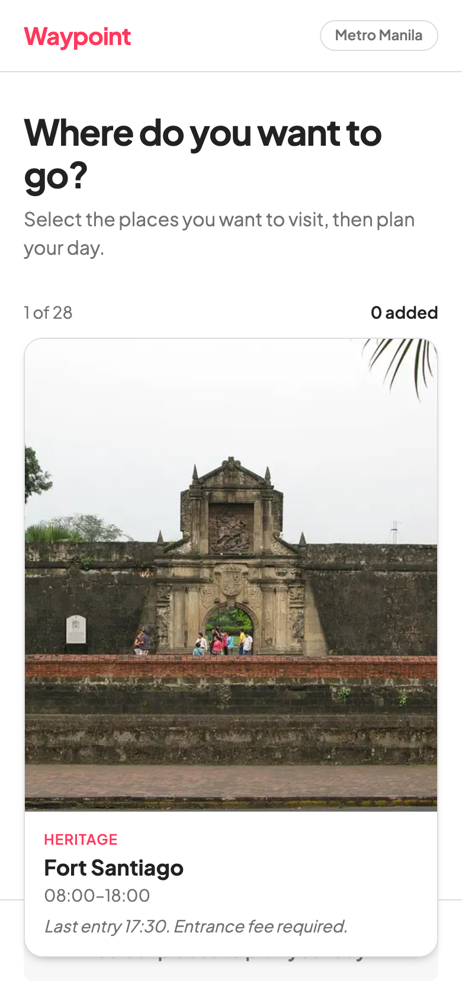
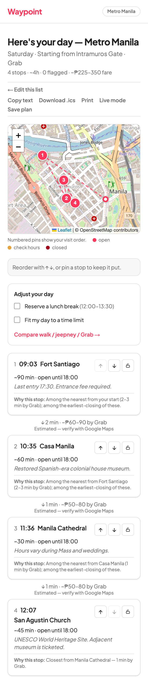
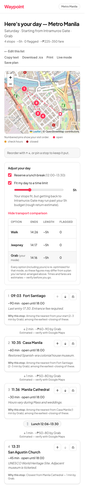
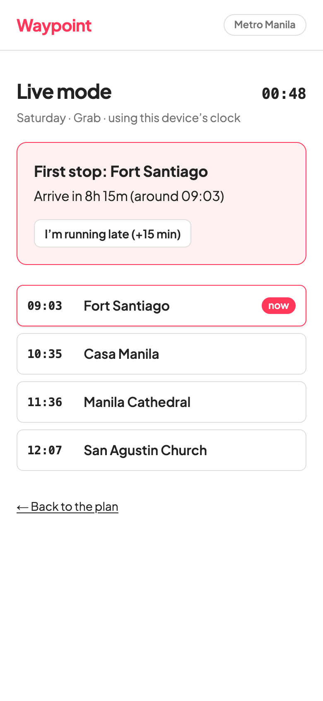
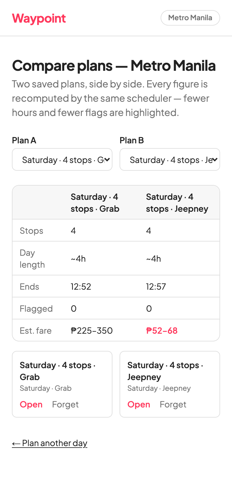

<div align="center">

# Waypoint

### Plan a day in Metro Manila you can trust.

You pick the places. Waypoint optimizes only the **order** of your day and shows its work —
flagging anything closed or out of reach instead of quietly dropping it.



</div>

---

## Why Waypoint

Most trip planners decide everything for you and hide the rest — you never know *why* a place
was dropped or reordered. Waypoint is built on the opposite idea: **trust through transparency.**

- **You choose what; it sequences when.** The algorithm only reorders your picks (nearest-next,
  mindful of closing times). It never adds, removes, or swaps a place.
- **Nothing is hidden.** A stop that's closed that day or that you'd reach too late is **flagged in
  plain sight**, never silently removed.
- **Every stop is explained.** A one-line "Why this stop" is drawn straight from the scheduler's own
  decision, so it can't claim something the algorithm didn't actually do — on the page *and* in every
  export.

This is a student project (DLSU) exploring that thesis. Metro Manila POI data is placeholder/demo data.

## How it works

<table>
<tr>
<td width="33%" valign="top" align="center">

<br><b>1 · Pick your places</b>
<br><sub>Swipe (or tap) through Metro Manila's heritage sites, museums, parks, markets, and churches. On wider screens it's a photo grid.</sub>
</td>
<td width="33%" valign="top" align="center">

<br><b>2 · Get your day, in order</b>
<br><sub>A sensible route on a numbered map, arrival times, a fare estimate, and a plain-language reason for every stop's position.</sub>
</td>
<td width="33%" valign="top" align="center">

<br><b>3 · Adjust &amp; compare</b>
<br><sub>Reserve a lunch break, fit the day to a time budget (over-budget stops grey out, never vanish), and compare walk / jeepney / Grab side by side.</sub>
</td>
</tr>
</table>

## Take it with you

<table>
<tr>
<td width="50%" valign="top" align="center">

<br><b>Live mode</b>
<br><sub>A device-clock companion for the day itself — what's now, what's next, "leave in ~N min", and an "I'm running late" reflow that keeps the plan (and its flags) honest.</sub>
</td>
<td width="50%" valign="top" align="center">

<br><b>Compare plans</b>
<br><sub>Save plans to your device and compare two side by side — the cheaper fare, shorter day, and fewer flags are highlighted. (Here: Jeepney ₱52–68 vs Grab ₱225–350.)</sub>
</td>
</tr>
</table>

You can also **copy the itinerary as text**, **download it as a calendar (.ics)** file, or **print**
it — flags and all — and every plan is a shareable, refresh-safe URL.

## Features

The core flow (pick → ordered, flagged, explained itinerary) plus nine optional "power features",
each toggleable from a single registry in [`web/lib/features.ts`](web/lib/features.ts) — flip a flag
to `false` and that feature disappears and its code tree-shakes out.

| Feature | What it does |
|---------|--------------|
| Curated presets | One-tap ready-made starter days on the landing page |
| Fit my day to N hours | Greys out (never deletes) stops that won't fit + an honest "wouldn't make it back" line |
| Fare estimator | Per-leg and per-day fare ranges (jeepney/Grab; walking is free) |
| What-if compare | Walk / Jeepney / Grab, re-optimized and shown side by side |
| Lunch window | Reserve a midday break; the rest of the day shifts around it |
| Offline | A service worker so a visited plan keeps working in an MRT tunnel |
| Live mode | The `/live` device-clock companion |
| Compare plans | Save plans locally and compare two side by side |
| Group vote | A single-device thumbs-up tally → plan the winners *(off by default — true multi-device voting needs a backend Waypoint deliberately doesn't have)* |

## Tech

- **Next.js 16** (App Router) · **React 19** · **TypeScript** · **Tailwind CSS v4**
- **Leaflet + OpenStreetMap** for the route map (no API key)
- **Vitest** for unit + component tests
- **No backend** — scheduling runs client-side over static JSON; deploys to Vercel.

## Getting started

```bash
cd web
npm install
npm run dev      # http://localhost:3000
```

> The `/result` page is heavy (map + many components) and hydrates slowly under the dev server. To
> click through the interactive features, use a production build: `npm run build && npm run start`.

```bash
npm run test     # unit + component tests
npm run build    # production build (also type-checks)
```

## Repository layout

```
web/                 The Next.js app (see web/README.md for full detail)
  app/               Routes: / · /plan · /result · /live · /compare · /vote · /credits
  components/        Selector, ResultView, MapView, WhatIfDrawer, LiveView, CompareView, …
  lib/               scheduler, reason, fit, fare, presets, plan-model, params, features, …
  data/<city>/       pois.json + transit-matrix.json (placeholder Metro Manila data)
docs/
  designs/           The approved product spec
  screenshots/       The images in this README
TODOS.md             Deferred / future work
```

The active city is chosen at build time via `NEXT_PUBLIC_CITY` (default `metro-manila`); adding a city
is a new `data/<slug>/` folder plus one entry in `web/lib/data.ts`.

---

<div align="center">
<sub>Transit times and fares are estimates — verify opening hours before you go. A student project exploring trust through transparency.</sub>
</div>
